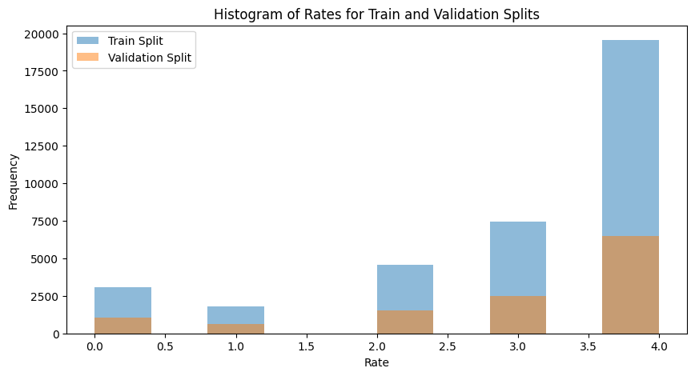
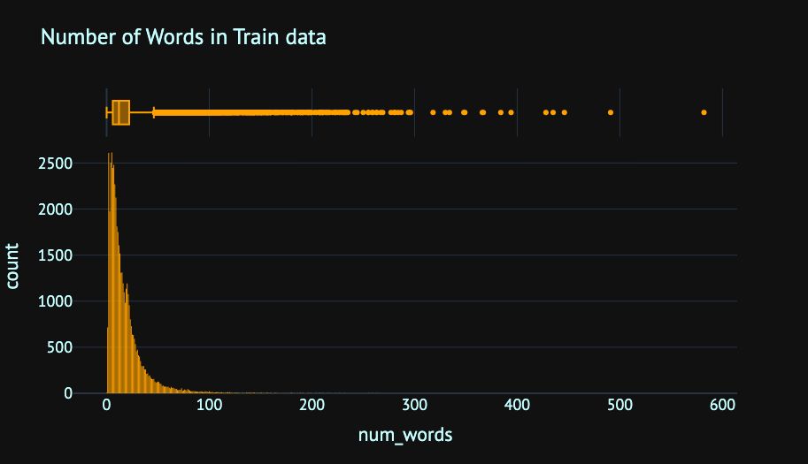
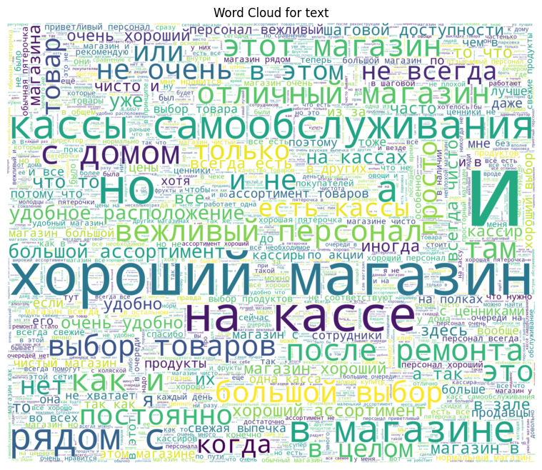
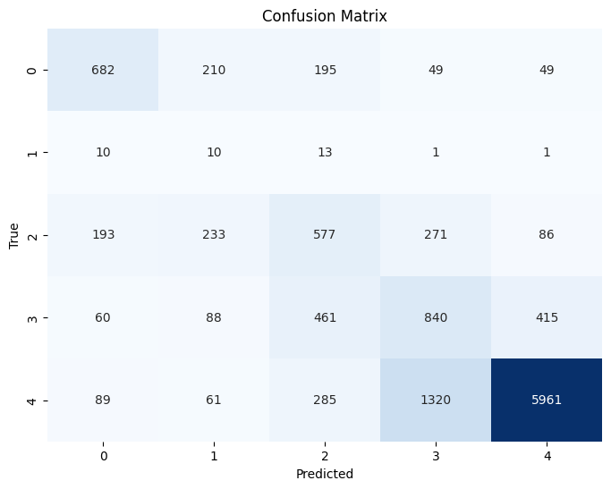
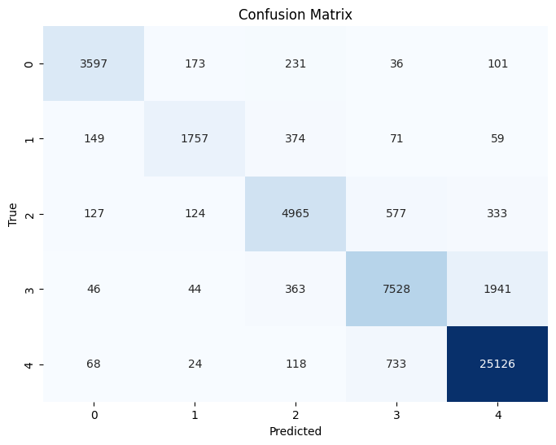
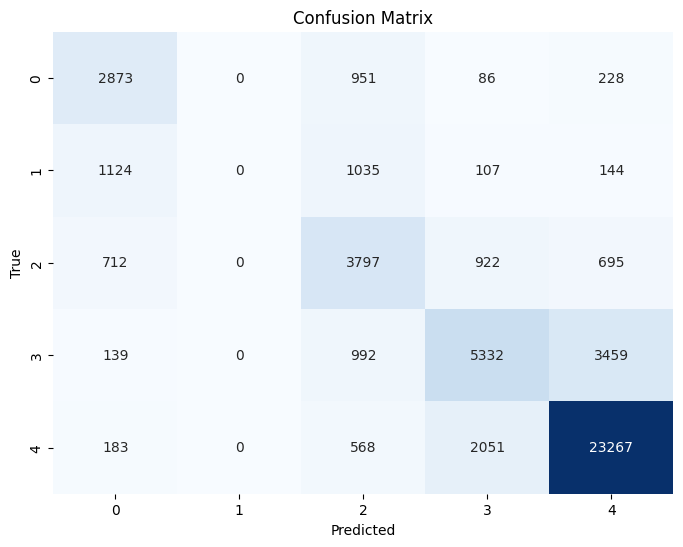
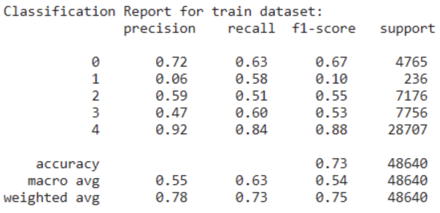

=========

# Description of task

Practical assignment related to the course [Natural Language Processing course (stream 5, autumn 2023)](https://ods.ai/tracks/nlp-course-autumn-23). 

**Practical Assignment 2**: Text multiclass classification: store's review rating.

> This task is to classify the store's review rating into 5 classes. The metric is *`F1-score`*.

Task organizers presented 4 baseline solutions based on logistic regression, catboost, LSTM and Transformers. As part of the club meetings at school 21, we analyzed the baselines and wrote our own notebook based on the predictions of transformers and recurrent networks, coupled with generative features.

# Our solution

> Stack: 
 * [PyTorch](https://pytorch.org/)
 * [TensorFlow](https://www.tensorflow.org/)
 * [Pre-trained models from Hugging Face](https://huggingface.co/)
 * [SpaCy](https://spacy.io/)
 * [NLP Profiler](https://github.com/neomatrix369/nlp_profiler)
 * [Boosting](https://github.com/a-milenkin/Competitive_Data_Science/tree/main/notebooks)
 * [Shap](https://shap.readthedocs.io/en/latest/)
 * [Optuna](https://optuna.org/)

We created [Dataset on kaggle](https://www.kaggle.com/datasets/akscent/ods-huawei) and make analysis in kaggle-notebooks. 

Our [EDA notebook](https://www.kaggle.com/code/akscent/review-classifer) demonstrane a few specifics:

 * Uneven class distribution which was solved using uniform split.
 >
 

 * The main problem is the unevenness of samples in classes.

 * The length of reviews can be zero or very long, however most are under 150 words.
  >
 Number of words in reveiws

  .png)

>
 Word Cloud on cleaned data

  
_________________________________________________________

**First of all we tried few approaches:**
1) Simple [multi-class classification](/src/transformer-classifer.ipynb) using a pytorch classifier using embeddings of the Bert model.
>
On val dataset

2) Simple classification using [recurrent classifier](https://www.kaggle.com/code/eleott/huaweytry) in pytorch and embeddings.
>
On train dataset

*We can see that the recurrent neural network model is very good at identifying classes in the training dataset.
However, overfitting was allowed here and the model performed poorly on test data*

3) Simple [cascaded binary classification](https://www.kaggle.com/code/eleott/cascade-binary) using tensorflow and lstm layers.
>
On all dataset

_________________________________________________________
In the end, we used the following approach to solve the problem:
1) Minimal cleaning of the dataset (because models trained on the same dirty data were used to generate features and predictions).
  - in particular, such sentences were cleaned up, for example `alovtdytvldvm++===amalot`
  - using a pre-trained summer of Russian texts, we reduced the few texts with a word length > 150
- we removed zero rows from the training dataset
2) Next, we trained the [LSTM](https://www.kaggle.com/code/eleott/cascade-binary) and [Transformers](/src/transformer-classifer.ipynb) models with the best hyperparameters. We received predictions for 5 classes as proba estimates.
3) We generated features using library tools for NLP tasks: pre-trained models, TF-IDF analysis, nlp_profiler in [ft-generation-train notebook](/src/feature-extraction-train.ipynb). Then we are make feature selection with shap and all our features listing in [ft-generation-test notebook](/src/feature-extraction-test.ipynb). 
4) That we estimated other multiclassifer models from ML in [choose_boosting notebook](https://www.kaggle.com/code/akscent/choice-of-boosting). We trained an ensemble of [boosting models](/src/ensemble-boosting.ipynb) with optimal hyperparameters and feature selection.

As a result, we received a sustainable f1-score metric of 0.7
>
On val dataset

# Notes

We can say that we have achieved good accuracy in recognizing comments corresponding to 5 stars. Also good for 1 star, absolutely terrible for 2 stars and below average for 3 and 4 stars.

We can say that, if there was more time, it would be possible to achieve a more accurate identification of problem classes using a more detailed consideration of the dataset and an analytical approach to feature generation.